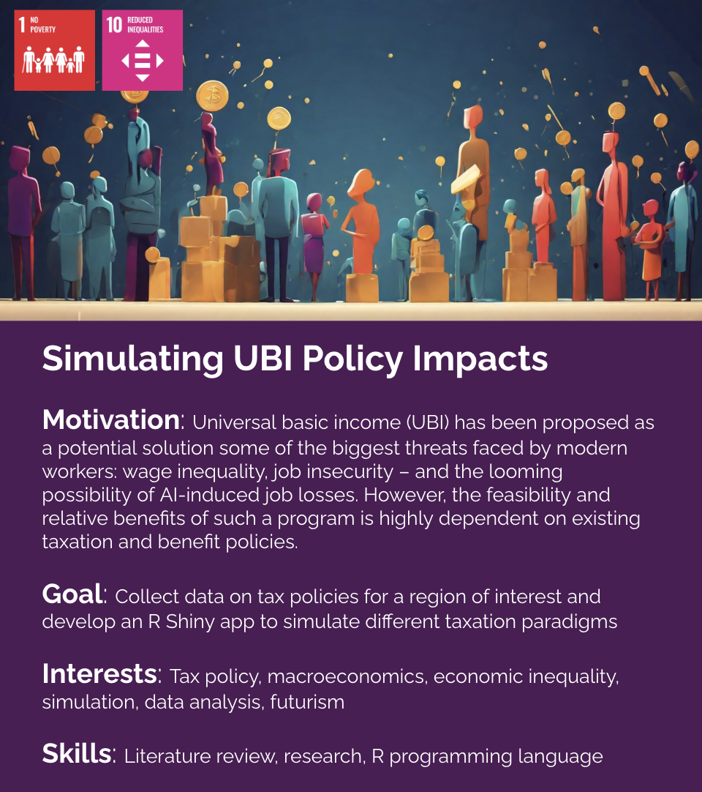

# Simulating UBI Policy Impacts

Universal basic income (UBI) has been proposed as a potential solution some of the biggest threats faced by modern workers: wage inequality, job insecurity – and the looming possibility of AI-induced job losses. However, the feasibility and relative benefits of such a program is highly dependent on existing taxation and benefit policies.

### Team Meetings:
[When2Meet](https://www.when2meet.com/?24215157-xRRLJ)

### Useful Links:

[Ontario-Taxes/Comparing Taxes.png at master · UnrequitedReason/Ontario-Taxes](https://github.com/UnrequitedReason/Ontario-Taxes/blob/master/Comparing%20Taxes.png)

[AI is coming for our jobs! Could universal basic income be the solution? | Global development | The Guardian](https://www.theguardian.com/global-development/2023/nov/16/ai-is-coming-for-our-jobs-could-universal-basic-income-be-the-solution)

[Introducing the Basic Income Builder](https://www.ubicenter.org/introducing-basic-income-builder)

[Universal Basic Income](https://ubicalculator.com/)

[Tax Justice Now](https://taxjusticenow.org/#/#makeYourOwnTaxPlan)

[How universal basic income would affect the black-white poverty and wealth gaps](https://www.ubicenter.org/how-universal-basic-income-would-affect-the-black-white-poverty-and-wealth-gaps)

[Universal Basic Income Research | Effective Altruism](https://www.effectivealtruism.org/articles/ea-global-2018-ubi)

[Mortality, existential risk, and universal basic income](https://www.ubicenter.org/mortality-existential-risk-ubi)

[PolicyEngine/policyengine-uk: The UK's only open-source static tax-benefit microsimulation model.](https://github.com/PolicyEngine/policyengine-uk)

[Tax-Calculator — Tax-Calculator](https://taxcalc.pslmodels.org/)

[Student debt cancellation is less progressive than universal payments](https://www.ubicenter.org/student-debt)

[One in five Americans with disabilities is in poverty. Even small basic incomes would help.](https://www.ubicenter.org/ada30)

[Basic income can make switching to a flat income tax progressive](https://www.ubicenter.org/us-flat-tax)

[Universal basic income - Wikipedia](https://en.wikipedia.org/wiki/Universal_basic_income)

[Global poverty in an unequal world: Who is considered poor in a rich country? And what does this mean for our understanding of global poverty? - Our World in Data](https://ourworldindata.org/higher-poverty-global-line)

[Economic Inequality - Our World in Data](https://ourworldindata.org/economic-inequality)

[How has income inequality within countries evolved over the past century? - Our World in Data](https://ourworldindata.org/how-has-income-inequality-within-countries-evolved-over-the-past-century)

[Income inequality before and after taxes: How much do countries redistribute income? - Our World in Data](https://ourworldindata.org/income-inequality-before-and-after-taxes)

[The history of global economic inequality - Our World in Data](https://ourworldindata.org/the-history-of-global-economic-inequality)

[How to simulate basic and guaranteed income policies in PolicyEngine US | by Max Ghenis | PolicyEngine](https://blog.policyengine.org/how-to-simulate-basic-and-guaranteed-income-policies-in-policyengine-us-6fbfaad5bb74)

[UBICenter/us-calc](https://github.com/UBICenter/us-calc)

[UBI Lab Network 2020 - 2022 Achievements](https://citizen-network.org/uploads/attachment/790/ubi-lab-network.pdf)

[Introducing PolicyEngine UK](https://www.ubicenter.org/introducing-policyengine)

[Funding UBI by eliminating the UK personal allowance](https://www.ubicenter.org/personal-allowance)

[PolicyEngine](https://policyengine.org/uk)
